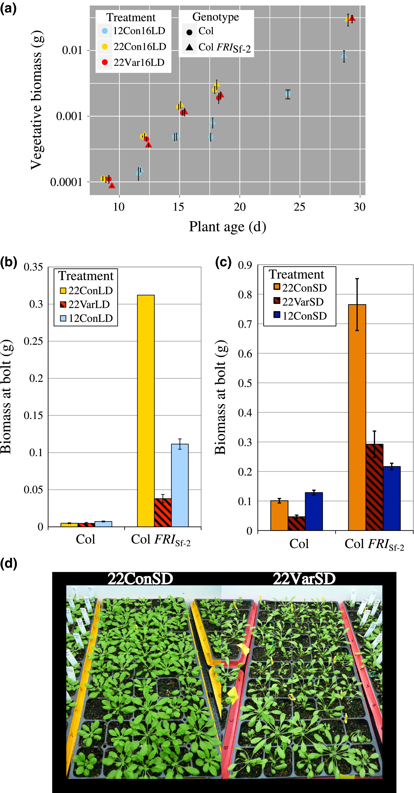
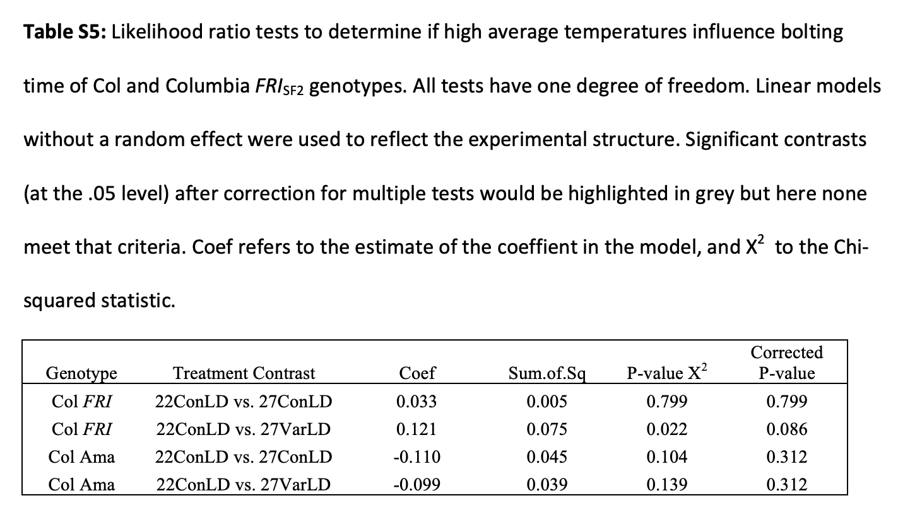
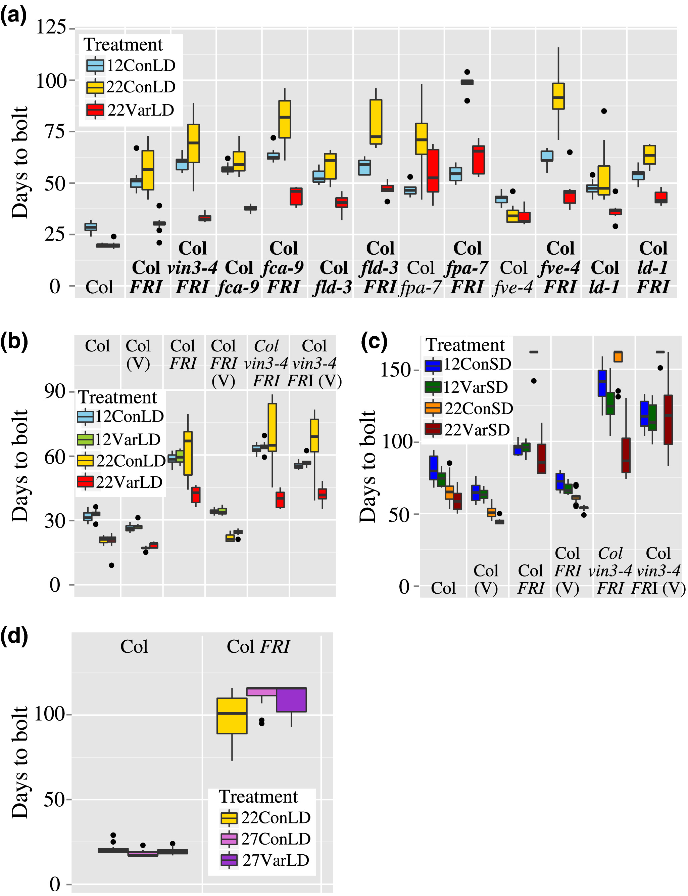

```{r setup}
#| include: false

# telling rendering engine where to output all of the figures associated with code chunks
knitr::opts_chunk$set(fig.path = "images/")
```

# Introduction

Temperature is an environmental cue that strongly influence plant development, especially flowering (the transition from vegetative growth to reproductive development)^1^. In this paper, the authors point out that much of the work in the field studying flowering in plants have been done in controlled laboratory conditions^2^. As temperatures often fluctuate in natural environments (i.e., in the field), it is expected that the gene expression that controls flowering and other aspects of development are affected by this variability. Since flowering has a huge impact in agriculture, this study conducts experiments that mimic the field to see how temperature influences flowering time in many *Arabidopsis thaliana* genotypes, including those with mutations in the flowering time pathway (flowering time mutants), to answer the following questions: (1) How do fluctuating temperatures affect flowering time?; (2) Do these effects (if any) rely on the day length, average temperature, or winter chilling exposure?; (3) How do mutations in different genes affect flowering responses to temperature fluctuations?; (4) Do these responses also affect growth and/or morphological differences? 

The authors performed three main experiments in their paper. The first experiment focused on assessing the differences in bolting time (also referred to as flowering time) across many loss-of-function mutants with mutations in genes that are important in the flowering pathway. In Experiment 2, they wanted to test whether high temperatures could explain the increased bolting time they saw in Experiment 1. Lastly, Experiment 3 determined the differences, if any, in bolting time between genotypes that are known to have high floral repression or late flowering. From these experiments, they collected plants at various time points (either throughout development/before bolting or at bolting) and recorded the biomass (in grams), the number of days it took to bolt, the number of leaves at bolting, etc.

In this report, I replicated data from Experiments 2 and 3, so I will focus on explaining them in more detail. For Experiment 2, they exposed the genotypes Col and Col FRI~Sf-2~ to various temperature treatments to see whether high temperatures could cause earlier flowering of plants lines that are known to flower later. For your reference, "Col" is often used as a control in laboratory settings (serves as a wild-type) and contains a natural loss-of-function mutation in a gene that suppresses flowering, called FRIGIDA (or FRI)^3^. "Col FRI~Sf-2~" has an active FRI gene, so flowering is very delayed unless various external cues, like temperature, silences FRI to promote flowering^3^. For example, vernalization is the process where a prolonged cold exposure (i.e. the winter) can promote flowering once favorable conditions return^1^. The two genotypes were exposed to three different treatments: Constant 22 degrees Celsius long-day (LD) conditions (22ConLD) as a control, Constant 27C LD conditions (27ConLD), and Variable/Fluctuating 27C LD conditions, where temperatures varied from 22C to 32C to mimic temperature fluctuations, but 27C was the mean. Long-day and short-day (SD) refer to the daylight requirement to trigger flowering; LD plants require >12 hours of light, while SD plants require <12 hours of light^4^. In this paper, LD was 16 hours of light, while SD was 8 hours of light. *A. thaliana* is a LD plant, but the authors used SD treatments to force the plant to rely only on temperature to decide when to flower (light is another external cue that plays a big role of when plants flower). They also performed Ordinary Least Squares (OLS) regression analyses and Likelihood Ratio Tests (LRT) specifically from these data.

In Experiment 3, they looked at the time it took to bolt in additional late-flowering mutants under Constant 12C (cold) LD conditions (12ConLD), Constant 22C LD conditions (22ConLD), and Variable 22C LD Conditions (22VarLD). The variable conditions ranges from 12C to 32C, with a mean of 22C. This was also done for SD conditions (12ConSD, 22ConSD, and 22VarSD). In this experiment, they also determined the biomass accumulation throughout vegetative development and at bolting for Col and Col FRI. They performed many other subsets of experiments, but I have briefly described those that are relevant to this report!

The authors found that there was a small, almost negligible response to temperature variability in wild-type and mutant genotypes overall, but there were a subset of genotypes that bolted faster in warm fluctuating temperatures rather than warn constant temperatures, specifically of the late-flowering genotypes like Col FRI. They also found some genotypes to bolt faster in constant cold conditions relative to constant warm conditions. They concluded that genes that regulate flowering act as a dynamic sensor that responds to a complex temperature environments. Therefore, they suggest that lab environments should mimic natural, fluctuating environments, as that can promote faster flowering.


# Descriptive Statistical Analysis

This section involves replicating a descriptive statistical analysis from the paper. For these analyses, the authors were interested in determining how various treatments (12ConLD, 22ConLD, 22Var16LD, 12ConSD, 22ConSD, and 22VarSD) influenced the growth before and at the bolting stage. They harvested the plants at multiple points before and at bolting to generate their biomass data. They collected biomass data from two different genotypes--Col and Col FRI~Sf-2~. They did eight replicates for each genotype in each treatment. The data for these analyses can be found in the "Biomass_Bolt.txt" and "Biomass_Age.txt" files.

To assess whether the treatments had an effect on the genotypes, they calculated the average biomass and made three different comparisons: (1) average biomass throughout vegetative development (before bolting) for 12ConLD, 22ConLD, and 22VarLD; (2) average biomass at bolt for 12ConLD, 22ConLD, and 22VarLD; (3) average biomass at bolt for 12ConSD, 22ConSD, and 22VarSD; all three comparisons used Col vs. Col FRI~Sf-2~. Thus, they were ultimately making comparisons between the treatments and their impacts on the two genotypes. Comparison 1 uses the "Biomass_Age.txt," while comparisons 2 and 3 use "Biomass_Bolt.txt." These comparisons are visualized as Figure 6 A-C in the paper. To visualize uncertainty in their data, they also calculated the standard error (SE) of the eight replicates.

In the portion of the report, I will be replicating their mean and standard average calculations for two of the three comparisons (Fig. 6 A and C), and their visualizations for them as well!

About the datasets: In the `Biomass_Bolt` dataset, there are seven variables--"Genotype", "Treatment", "Treatment.detail", "Chamber.ID", "Days.to.Bolt", "Rosette.leaf.num", and "weight.grams." The ones that are relevant to this analysis are "Genotype", "Treatment", "Days.to.Bolt", and "weight.grams." "Genotype" is exactly what it sounds like and contains either "Col" or Col FRI." "Treatment" contains the various treatments, denoted as I mentioned them above (i.e., 22ConLD, etc.). "Days.to.Bolt" describes the number of days it took to bolting from the initial seed sowing stage. Lastly, "weight.grams" describes the tissue sample weight in grams when collected.

`Biomass_Age` has an additional variable called "Replicate," but it is not directly involved in the replication below. Notably, the variable "Days.to.bolt" in the previous dataset is replaced with "Age," which is the number of days post-germination when the samples were weighed. In this analysis, "Genotype", "Treatment", "Age", and "weight.grams." are the relevant variables.


### Code chunk 1: Loading in the relevant datasets and visualizing the data

To load them in the appropriate files, I chose to use the `read_tsv()` function within the {tidyverse} package, since they are text files. Therefore, I first loaded in the package ({tidyverse}) and assigned the dataset URL (from GitHub) to temporary file names ("f1", "f2", etc.) to use as the argument in `read_tsv()`. I initially had trouble loading in both datasets as is, as their observations (labelled as 1, 2, 3, etc.) had no column name and was, therefore, parsed under the first column name, "Genotype," which was for the second column; this caused the subsequent columns to be parsed incorrectly. Thus, I specified the column names manually using `col_names()` and skipped the first line of the dataset with `skip()` equal to 1 to remove their first row, which was the variable names they used. I used the same approach for both datasets. The "Biomass_Age.txt" file is the object `biomass_age`, while "Biomass_Bolt.txt" is `biomass_bolt`.

After loading each dataset in, I briefly looked through them with `head()`, `names()`, `str()`, and `skim()`. `head()` shows the first six rows, `names()` shows the variable names, `str()` provides an overview of the internal structure of the dataset, including variable data types, and `skim()` gives a comprehensive overview for the categorical and numeric variables. For the categorical variables like "Genotype" and "Treatment" for example, `skim()` provides the number of missing variables, completeness, min/max, empty and unique values, and whitespace. For numeric variables like "weight.grams," it gives the missing variables, completeness, min (p0) /max (p100), mean, standard deviation, median (p50), 1st and 3rd quartiles, as well as histograms. Overall, these functions allowed me (and hopefully you!) to quickly grasp the contents of the data.
```{r}
# LOADING IN DATA:

# loading in required packages for downstream code
library(tidyverse) # used for various functions
library(skimr) # specifically used for `skim()`

# biomass by age data
f1 <- "https://raw.githubusercontent.com/sandanihk/data-analysis-replication/refs/heads/main/data/Biomass_Age.txt"

# using read_tsv() to read in text file
biomass_age <- read_tsv(file = f1, # using assigned file object
                        skip = 1, # removing first row of header names
                        col_names = c("Observation", "Genotype", "Treatment", "Chamber.ID", "Replicate", "Age", "Num.Sample", "Rosette.leaf.num", "weight.grams")) # manually specifying column names

# overview of age dataset
head(biomass_age) # first 6 rows
names(biomass_age) # variable/column names
str(biomass_age) # internal structure
skim(biomass_age) # comprehensive overview


# biomass at bolting data
f2 <- "https://raw.githubusercontent.com/sandanihk/data-analysis-replication/refs/heads/main/data/Biomass_Bolt.txt"

biomass_bolt <- read_tsv(file = f2, 
                         skip = 1, # removing first row of header names
                         col_names = c("Observation", "Genotype", "Treatment", "Treatment.detail", "Chamber.ID", "Days.to.Bolt", "Rosette.leaf.num", "weight.grams")) # manually specifying column names

# overview of bolt dataset
head(biomass_bolt) # first 6 rows
names(biomass_bolt) # variable/column names
str(biomass_bolt) # internal structure
skim(biomass_bolt) # comprehensive overview
```

**Descriptive Statistical Analysis 1:** *Calculating the average biomass throughout vegetative development (before bolting) for 12ConLD, 22ConLD, and 22VarLD conditions*


### Code chunk 2: Data wrangling

To calculate the average biomass throughout development (at different ages) by treatments and genotype, I manipulated the `biomass_age` dataset using the pipe operator and various {dplyr} functions, and assigned the output to a temporary dataset, `temp_biomass_age`. First, I filtered the dataset to include only the treatments of interest, which were the long day conditions (12ConLD, 22ConLD, and 22VarLD), using %in%. %in% is a operator the tests whether each value appears in a set of values and returns a logical vector; in this case, R will only keep the rows where "Treatment" is one of the three values and filter keeps the rows that are TRUE. Since the authors calculated the mean and SE by treatment and genotype, I used `group_by()` to group the data by "Treatment", "Genotype", and "Age" (since they took replicates) and `summarize()` to calculate the mean ("avgBiomass"), standard deviation (SD) ("sdBiomass"), and SE ("seBiomass") from the grouped data. SE is the sample SD of the weight divided by the square root of their sample size (which was determined by `n()` and was assigned to "n_cases"). `na.rm()` was set to TRUE to remove missing values, if any. I got an error for the grouping, which told me to alter the `.groups()` argument; thus, I changed the argument to "drop." From my understanding, "drop" will drop the grouping that is attached so it will behave normally in future operations. Lastly, I visualized the updated data frame stored in the `temp_biomass_age` object.
```{r}
# Biomass accumulation of Col, Col-FRI Sf-2 in LD conditions (Fig. 6 A)
# DATA WRANGLING

# loading in required package
library(dplyr)

temp_biomass_age <- biomass_age |>
  filter(Treatment %in% c("12ConLD", "22ConLD", "22VarLD")) |> # filtering specific treatment data
  group_by(Treatment, Genotype, Age) |> # grouping by variables of interest
  summarize(n_cases = n(), # determining # of cases per set of observations
    avgBiomass = mean(weight.grams, na.rm = TRUE), # calculating avg. biomass per group
    sdBiomass = sd(weight.grams, na.rm = TRUE), # calculating SD per group
    seBiomass = sdBiomass / sqrt(n_cases), # calculating SE per group
    .groups = "drop") # drops grouping levels

# calling output table 
temp_biomass_age 
```

### Code chunk 3: Data visualization

The authors did not explicitly present the results in a table or in the body of the text, and only presented them as a visualization (Fig. 6 A). To ensure I successfully replicated this analysis, I, therefore, recreated their visualization to the best of my ability.

I used {ggplot2} to create a scatterplot. The x-axis was set to age, while the y-axis was set to the average biomass. I colored the points by treatment and gave the genotypes specific shapes, as they did in their visualization; this allowed for clear identification and comparisons between the groups of interest. 

In their visualization, they were able to jitter the points (for overlap) and align their error bars, but I had a hard time figuring out how to do this. My initial instinct was to only do `geom_jitter()` with `geom_errorbar()`; although this jitters the points well, the error bars stay true to the original value and misalign with the points. Thus, the closest I could get was to use `geom_point()` to create a scatter plot with the `position()` argument was set to "position_jitterdodge", which jitters and dodges the points. For some reason, this combination allowed the error bars to align with the points. When I tried to change the color to black (by color = "black" in `geom_errorbar`), it started to misalign, so I ultimately removed that argument. Unfortunately, it makes it hard to visualize the SEs, but they can still be detected.

To calculate the range of the error bars `geom_errobar()`, I set the "ymin" and "ymax" values to be the average biomass +/- the SE for by each treatment and group, since the error bars represent variability and can simply be the SE subtracted and added from the mean. The `position()` argument was set to "position_dodge" with a width of 0.5, which defines how apart the error bars should be to prevent overlap. The `width()` argument was made to 0.4 to control the horizontal cap size of the bars.

Colors were added manually using `scale_color_manual()`. The theme was adjusted to match there, which I think was `theme_dark()`. For the y-axis, `scale_y_log10()` was used because the biomass values were very small and spanned multiple orders of magnitude. To customize the plot to match the paper's, I used the arguments in `theme()`. Fortunately, I took Claus Wilke's Data Visualization class and have experience with making visualizations, so I was able to use some things I learned! The font and size were adjusted with the `text()` arguments. The axes were modified with `axis.title.y()` and `axis.ticks.x()`. The position of the legend was move to the top left corner with `legend.position()` and `legend.justification`; `legend.position()` moves the legend box, while `legend.justification` aligns the legend relative to the position you choose. There were other functions used throughout the code that is acknowledged in the code as comments.

Overall, this visualization was assigned to the object `LD_age`, since we were looking at the biomass accumulation relative to age in LD conditions. The whole assignment was enclosed in parentheses so it would automatically run.
```{r}
# VISUALIZATION 

# loading in ggplot for visualizations
library(ggplot2)

# Fig. 6 A visualization replication

(LD_age <- ggplot(data = temp_biomass_age,
                   aes(x = Age, y = avgBiomass, color = Treatment, shape = Genotype)) + # assigning axes 
  geom_point(position = position_jitterdodge(jitter.width = 0.2, dodge.width = 0.5), # adjusting point layout 
             size = 3) + #adjusting size of points
  geom_errorbar(aes(ymin = avgBiomass - seBiomass, ymax = avgBiomass + seBiomass), # setting error bars
                position = position_dodge(width = 0.5), width = 0.4) + # aligning error bars with points
  scale_color_manual(values = c("12ConLD" = "skyblue2", # assigning colors to groups
                               "22ConLD" = "gold2",
                               "22VarLD" = "red2")) +
    scale_y_log10(limits = c(0.000085, 0.05), # changing y-axis to log scale
                  breaks = c(0.0001, 0.001, 0.01),
                  labels = scales::label_number()) + # displays numbers as decimals instead of scientific notation
    xlab("Plant age (d)") + # assigning axes titles 
    ylab("Vegetative biomass (g)") +
    theme_dark() + # matching their theme
    theme( 
      text = element_text(size = 14, family = "Times New Roman"), # adjusting text
      axis.title.y = element_text(margin = margin(0, 5, 0, 0)), # move y-axis title farther out
      axis.ticks.x = element_blank(), # removing x-axis ticks
      legend.position = c(0.01, 0.99), # moving legend around
      legend.justification = c(0.01, 0.99), # ""
      legend.box = "horizontal", # makes legends side by side
      legend.key = element_rect(fill = "white"), # making the whole legend white
      legend.background = element_rect(fill = "white"), # changing legend background
      panel.grid = element_line(color = "white")) # changing gridline color
  ) 
```

### Code chunk 4: Comparison to original

Here is the original visualization seen in Fig. 6 A for comparison^2^. This was embedded using the Tony included in the DAR module.
```{r}
#| out-width: 200px

# loading in required package for original images
library(knitr) # this might not be needed since I do "knitr::"


```

*Results and Interpretation:* Based on the scatterplot, it is clear that vegetative biomass accumulates as plant age increases. There does not seem to be a clear difference between the two genotype in which accumulates more mass by age, but there is a clear indication that the temperature treatment influences biomass. The cool temperatures (12ConLD) shows reduced biomass accumulation compared to either the warm constant (22ConLD) or fluctuating temperatures (22VarLD). These results suggest that temperature significantly modulates the vegetative growth rates for these plants, while constant or fluctuating warm temperatures don't seem to affect accumulation that much.

I think this plot looks similar to the original, but it was pretty difficult handling the error bar alignment and jittering situation. It would have been nice if they included a table for their descriptive statistical analyses for a precise comparison, but replicating the graph made it easy to do, too.


**Descriptive Statistical Analysis 2:** *Calculating the average biomass at bolting for 12ConSD, 22ConSD, and 22VarSD conditions*

Another analysis they did was look at the average biomass at the bolting stage for both genotypes across LD and SD conditions. To prevent this report from being excessive, I decided to replicate one of these analyses, so since I previously did LD conditions, this time I will do SD! The exact same code (with the exception of changing variable names form SD -> LD) can be used to perform the LD analysis.


### Code Chunk 5: Data wrangling

To calculate the average biomass across genotypes in SD conditions, I, again, manipulated the `biomass_bolt` dataset with the pipe operator and {dplyr} functions. The final output was assigned to the temporary dataset, `temp_biomass_bolt_SD`. To begin the wrangling, I filtered the relevant treatments, which were the SD conditions (12ConSD, 22ConSD, and 22VarSD) using the %in% operator, which only kept those rows. Since the mean and SE were calculated by treatment and genotype, I used `group_by()` to group the data by "Treatment", "Genotype. This grouping was relevant when I used `summarize()` to calculate the mean ("avgBiomass"), SD ("sdBiomass"), and SE ("seBiomass"). Again, SE was the sample SD weight (in grams) divided by the square root of their sample size (determined by `n()` in "n_cases"). `na.rm()` was set to TRUE to remove any NA values. The `.groups()` argument was to "drop" since I got a error. Lastly, the temporary filtered `temp_biomass_bolt_SD` object was visualized.
```{r}
# Fig. 6 C: Avg. plant biomass at bolt in LD and SD conditions.
# DATA WRANGLING

# long day biomass bolt data
temp_biomass_bolt_LD <- biomass_bolt |> # assigning to temporary dataset
  filter(Treatment %in% c("22ConLD", "22VarLD", "12ConLD")) |> # filtering specific treatment data
  group_by(Treatment, Genotype) |> # grouping by variables of interest
  summarize(n_cases = n(), # determining # of cases per set of observations
    avgBiomass = mean(weight.grams, na.rm = TRUE), # calculating avg. biomass per group
    sdBiomass = sd(weight.grams, na.rm = TRUE), # calculating SD per group
    seBiomass = sdBiomass / sqrt(n_cases), # calculating SE per group
    .groups = "drop") # drops grouping levels

# short day biomass bolt data
temp_biomass_bolt_SD <- biomass_bolt |> # assigning to temp. object
  filter(Treatment %in% c("22ConSD", "22VarSD", "12ConSD")) |> # filtering for SD treatments
  group_by(Treatment, Genotype) |> # grouping data by treatment and genotypes
  summarize(n_cases = n(), # looking at # of cases per grouping
    avgBiomass = mean(weight.grams, na.rm = TRUE), # calculating avg. biomass for groups
    sdBiomass = sd(weight.grams, na.rm = TRUE), # calculating SD per group
    seBiomass = sdBiomass / sqrt(n_cases), # calculating SE per group
    .groups = "drop") # dropping levels

# visualizing data frame
temp_biomass_bolt_SD
```

### Code chunk 6: Data visualization

Again, the authors only presented their descriptive statistical analysis as a visualization (Fig. 6 C), so to ensure the replication was successful, I recreated their visualization.

With {ggplot2}, I created a bar graph (`geom_bar_pattern()`). The x-axis was the genotype, the y-axis was the average biomass at bolt, and the bars were colored by treatment.

To match their graph and follow their order of the bars, I first converted the "Treatment" data to be treated as a factor, so that the bars would not be ordered alphabetically (the default order by R), but, rather, by the order the authors chose. This was done using the "$" operator, `factor()`, and the `levels()` argument to define the desired order.

Since the 22VarSD data were striped, I installed and loaded in the {ggpattern} package to use `geom_bar_pattern()`. Within the function, `stat()` was set to "identity" to tell R to use the already calculated values within the y-axis column (avgBiomass) and `position()` was set to "dodge" to places the bars for each treatment side-by-side within each genotype category. Additionally, because using `geom_bar_pattern()` and setting that equal to "stripe" causes all the bars to be striped, I used a conditional statement to tell R to only add stripes to data from 22VarSD conditions; if they were not part of 22VarSD, no stripes are added. The stripes and other aspects of the bars were modified using other `pattern_[x]`, etc. functions. 

As described above, the SE was used to add error bars with `geom_errorbar()`, where the SE was added and substracted from the average biomass. The `position()` was set to "position_dodge" to correspond with the dodged bars. To make the bars touch the bottom of the y-axis, I used `expand()` within `scale_y_continuous()`. `scale_fill_manual()` was set to colors I thought best matched their bar colors. Various aspects with the theme were altered using the `element_[x]()` functions. I particularly had a hard to removing the stripes from the conditions that were not striped (22ConSD and 12ConSD) from the legend--I was not able to figure that out!

Overall, the plot output was assigned to the object `SD_bolt` and the code was wrapped in parentheses for immediate output upon running.
```{r}
# VISUALIZATION

# loading in required package for stripes
library(ggpattern)


# adjusting SD treatment leveling by converting to factor
temp_biomass_bolt_SD$Treatment <- factor(temp_biomass_bolt_SD$Treatment,
                                      levels = c("22ConSD", "22VarSD", "12ConSD"))

# Fig. 6 C visualization replication
(SD_bolt <- ggplot(data = temp_biomass_bolt_SD,
             aes(x = Genotype, y = avgBiomass, fill = Treatment)) + # assigning axes
    geom_bar_pattern(stat = "identity", position = "dodge", 
                   pattern = ifelse(temp_biomass_bolt_SD$Treatment == "22VarSD", "stripe", "none"), # adding stripes to 22VarSD condition only
                   pattern_angle = 150, # adjusting stripe angle
                   pattern_fill = "black", # coloring stripes black
                   pattern_color = "black", # ""
                   color = "black") + # coloring outline of bars black
  geom_errorbar(aes(ymin = avgBiomass - seBiomass, ymax = avgBiomass + seBiomass), # calculating SE
                position = position_dodge(0.9), # to align with dodged bars
                width = 0.2) + # controls horizontal caps
  xlab(NULL) + # removing x-axis label
  ylab("Biomass at bolt (g)") + # y-axis label
  scale_y_continuous(limits = c(0, 0.9), breaks = seq(0, 0.9, by = 0.1), # adjusting y-axis bounds
                     expand = expansion(mult = c(0, 0.05))) + # to make bars touch bottom
  scale_fill_manual(values = c("22ConSD" = "darkorange3", # coloring bars by treatment
                               "22VarSD" = "red4",
                               "12ConSD" = "navyblue")) +
  theme_bw() + # matching their theme
  theme(text = element_text(size = 14, family = "Times New Roman"), # adjusting text
        axis.title.y = element_text(margin = margin(0,10,0,0)), # adjusting y-axis title position
          axis.ticks.y = element_blank(), # removing y-axis ticks
          legend.position = c(0.01, 0.99), # adjusting legend position
          legend.justification = c(0.01, 0.99), # ""
          legend.background = element_rect(color = "black", fill = "white"), # adjusting legend box
        panel.grid.major = element_blank()) # removing vertical major grid lines
  )
```

### Code chunk 7: Comparison to original

This is the original visualization seen in Fig. 6 C for comparison^2^.
```{r}
#| out-width: 200px

# loading in required package for original images
library(knitr)


```

*Results and Interpretation:*  Based on the `temp_biomass_bolt_SD` table and `SD_bolt` graph, the bimass at bolt in SD conditions were quite different across genotypes. It seems that the wild-type undergoes less vegetative growth before bolting, while Col FRI continues to grow vegetatively until flowering is induced. In the variable SD conditions (22VarSD), the variable temperatures seemed to cause earlier bolting in Col, as well as Col FRI relative to constant warm temperatures (22ConSD). Additionally, it seems like the cool constant temperatures (12ConSD) did affect the biomass at bolting for Col that much, but had a greater effect on Col FRI, reducing the biomass almost 4-fold. This shows that these cooler temperatures promote bolting much earlier in Col FRI relative to warm temperatures, suggesting the FRI gene (represses flowering) is less active in these conditions, allowing the plant flower.

The replicated analysis looks similar to the original. Again, it would be nice to have a table of the statistics used to make this plot, but other than that, I think I had everything I needed to replicate this analysis.


# Inferential Statistical Analysis

This portion of the report will focus on replicating an inferential statistical analysis. The authors performed many statistical analyses, but I chose a regression analysis, since we covered regression extensively in class! 


**Inferential Statistical Analysis 1:** *Determing whether extreme high temperatures affects bolting*

In this specific experiment, they were interested in assessing whether extreme high constant and fluctuating temperatures affected the bolting response in the plants. They grew Col and Col FRI~SF-2~ in constant (27 degrees Celsius) and fluctuating (22 to 32 degrees Celsius) LD conditions. As a control, the results were compared to the same genotypes exposed to a 22 degrees Celsius (warm conditions) LD treatment. There were 12 replicates for each genotype.

### Code chunk 8: Analysis description and equation

With their data, they performed a regression analysis and likelihood ratio test (LRT) to compare 27ConLD and 27VarLD against 22ConLD (control) for each genotype (Col Ama and Col FRI). This LRT model was done to determine whether temperature treatments improve the fit of the model they use when compared to simpler, null version. The null model would assume that temperature does not predict bolting, while the alternative model incorporates the various temperature treatments. I have included their equation below (Equation 4)^2^: 
```{r}
#| out-width: 200px

# loading in required package for original images
library(knitr)

knitr::include_graphics("Exp 2 Regression Analysis Equation.png")
```

About the dataset: The file for the dataset used in this experiment is called "Experiment2.txt." In the original dataset, there are 4 variables (other than the observation number): "Genotype", "Treatment", "Days.to.Bolt", and "Notes." These variables hold the same meaning as described in the other datasets used in the descriptive statistical analyses. I wanted to note that there were three unique genotypes--Col Ama, Col-0, and Col FRI--but for this analysis, only Col Ama and Col FRI were used. Col Ama and Col-0 are both standard wild-type accessions (I believe they should essentially be the same), Col Ama just happens to be from a professor named R. Amasino.


### Code chunk 9: Loading in data

To begin loading in the data, I assinged the URL to "f3" so it can be easily used in the file argument in `read_tsv()`. I had the same parsing issue as before, so I had to use `skip()` and manually enter the column names, as the individual observations column did not have a variable name.

In the paper, the other specifically noted that the "Days.to.Bolt" (DTB) data were log-transformed before performing their analysis. Thus, I created a new, temporary dataset (called `temp_exp_2`) where I added a new column called `logDTB` for the log-transformed DTB data. Additionally, I modified the existing "Treatment" column to be converted into a categorical factor to assign the control (22ConLD) as the reference level (intercept). This would allow for direct assessment of the effects of temperature magnitude and variance relative to the control. To provide an overview of the dataset, I used `head()`, `names()`, `str()`, and `skim()`. The purpose of each function is described in the previous descriptive statistical analysis. With `names()`, you can see that the new `logDTB` was added successfully. With `str()`, you can see that "Treatment" is now treated as a factor. With `skim()`, you can see the various tibbles for each type of variable, such as character, factor, and numeric. For the factor tibble, it gives the variable name, missing values, completeness, whether its ordered, unique values, and most frequent values.
```{r}
# loading in dataset URL
f3 <- "https://raw.githubusercontent.com/sandanihk/data-analysis-replication/refs/heads/main/data/Experiment2.txt"

# experiment 2 data read in
exp_2 <- read_tsv(file = f3, 
                  skip = 1, # removing first row of header names
                  col_names = c("Observation", "Genotype", "Treatment", "Days.to.Bolt", "Notes")) # manually specifying column names


# creating a temporary dataset for downstream analyses
temp_exp_2 <- exp_2 |>
  mutate(logDTB = log(Days.to.Bolt)) |> # adding new column for easy reference
  mutate(Treatment = factor(Treatment)) |> # converting to factor 
  mutate(Treatment = relevel(Treatment, ref = "22ConLD")) # altering reference level

# exploratory analyses of dataset
head(temp_exp_2) # first 6 rows
names(temp_exp_2) # variables
str(temp_exp_2) # internal structure
skim(temp_exp_2) # comprehensive overview of data types
```

### Code chunk 10: Quick visualization

I first wanted to quickly visualize the relationship between the treatments for each genotype to get an idea of the data I was working with; this visualization was not part of their paper. I hope this also helps you visually see the difference in bolting between the genotypes.
```{r}
# visualizing the relationship between DTB (continous) vs. treatment (categorical)
(p_relation <- ggplot(data = temp_exp_2,
                     aes(x = Treatment, y = logDTB, color = Genotype)) + # assigning axes
  geom_boxplot(na.rm = TRUE) +
  geom_jitter(alpha = 0.3) + # jittering points; alpha controls opacity
  facet_grid(~Genotype)) # faceting plots by genotype
```

*Results and Interpretation:* Based on the boxplots, you can see that the Col FRI genotype clearly flowers much later than the Col genotypes across all conditions. For Col FRI, there does seem to be more variability in the 22ConLD condition and a lower median compared to the other 27 degrees Celsius treatments, suggesting that it bolts earlier under "normal" conditions. The median for 27C treatments for this genotype seem to be high and very similar. This is because they terminated the experiment after 116 days, so for the plants that did not bolt after 116 days, DTB was recorded as 116. Thus, many of the plants did not flower.

When comparing the two Col genotypes, it seems like under 22LD conditions, they bolted around the same time. Extreme high temperatures (constant or fluctuating) may have resulted in slightly earlier bolting. What is the most striking is the 27ConLD conditions for Col-0; those constant extreme temperatures seems to result in notably earlier flowering compared to the other treatments and even the other Col Ama genotype. I would have assumed that both Col genotypes would results in similar data since they are of the same genetic background.


### Code chunk 11: Function for running OLS linear models and performing a LRT

In their final results table, the presented the likelihood ratio tests to see if high temperatures influenced bolting in Col and ColFRI~Sf-2~. Their final table showed the genotype (either Col FRI or Col Ama), the treatment contrast (22ConLD vs. 27ConLD or 22VarLD), the regression coefficients, sum of squares, p-value in a Chi-squared test, and corrected p-value (ensures that the probability of making false positive remain below 0.05). Their final results are found in the Supporting Information (Table S5).

To attempt replicating their analysis, I created a function called `calc_lrt_contrast` to calculate the likelihood ratio to determine whether the difference between the alternative and null models are big enough to matter (i.e. performing pairwise inferential tests). I defined three arguments in this function, sub_data (subset of the data frame), and trt_1 and _2 (character strings for the experimental conditions). The first line of the function uses the %in% operator within `filter()` to subset the data frame to include only observations that belong to the two specific treatment levels (22C and 27C).

Within the function, two OLS models were created with the `lm()` function. The alternative model (`m_full`) specifies the logDTB as a function of the treatment factor, while the null model (`m_null`) is constrained to the intercept only (logDTB ~ 1). To determine the statistical support for the treatment effect, the log-likelihood of each model was extracted. The likelihood ratio statistic is then derived as *D* = 2 x *(log-likelihood~full~ - log-likelihood~null~)*. This statistic follows a Chi-squared distribution under the null hypothesis, and the output was assigned to `chisq_val`; this value was converted with `as.numeric()` to convert the `logLik` object into a number.

The probability of the observed LR statistic is calculated using the `pchisq()` function, assuming one degree of freedom (one parameter difference between the models, as the alternative model has two paraments (beta0 and beta1), while the null model only has beta0). Finally, the function encapsulates the regression coefficient, the "Treatment" sum of squares (extracted from the ANOVA table for `m_full`), and the Chi-squared and p-values into a tibble to ultimately return the data structured. More specifically, the `anova()` function was used to isolate (with bracket extraction) the variance caused by the treatment (variation caused by 22C vs. 27C conditions) from the full linear model. This reports the sum of squares for the treatment effect, quantifying the total squared deviation from the mean that is attributable to the temperature regimes. To prevent my descriptions from becoming excessive, I heavily annotated the following R code chunks as well!
```{r}
# DATA WRANGLING

# Table S5: LRT for high temperatures effects on genotypes

# loading in package
library(broom) # for tidy modeling

# function to calculate Likelihood Ratio (Chisq)
calc_lrt_contrast <- function(sub_data, trt_1, trt_2) { # defining arguments in function
  comparison_data <- sub_data |> # using |> to pass sub_data into filter
    filter(Treatment%in%c(trt_1, trt_2)) # filtering specific treatments with logical indexing
  
  m_full <- lm(logDTB ~ Treatment, data = comparison_data) # alternative model where treatment predicts logDTB
  m_null <- lm(logDTB ~ 1, data = comparison_data) # nested null model to intercept only
  
  # performing ANOVA on full model to extract treatment sum of squares
  ss_val <- anova(m_full)["Treatment","Sum Sq"] # pulls specific numeric values
  
  # true likelihood ratio Chi-squared statistic
  stats_lrt <- logLik(m_full) # extracting maximized log-likelihood value for alternative model
  stats_null <- logLik(m_null) # extracting maximized log-likelihood value for null model
  chisq_val <- as.numeric(2 * (stats_lrt - stats_null)) # calculating LR statistic using formula
  
  # calculating p-value from Chi-squared distribution function
  p_val <- pchisq(chisq_val, df = 1, lower.tail = FALSE) # FALSE looks at area to the right

  # packaging results
  tibble(contrast = paste(trt_1, "vs.", trt_2), # creates a string label
         coef = coef(m_full)[2], # extracts second coefficient (slope of trt_2 relative to trt_1)
         sum_of_squares = ss_val, # passes sum of squares
         chisq = chisq_val, # passes Chi-square value
         p_val = p_val # passes p-value
         )
}
```

### Code chunk 12: Final results table

The function is used in the final output called `final_table`. Making this table involved using `group_by()` and `nest()` to split the data by the "Genotype" variable into a list structure (creates "Genotype" with its own mini data frame). With `purrr:map()`, I was able to apply the calc_lrt_contrast function iteratively across each nested data frame to execute two comparisons: 22ConLD vs. 27ConLD and 22ConLD vs. 27VarLD, which allows for independent estimation of temperature effect within each genotype. The "data" argument was referring to the column name created by the `nest()` function, which holds the mini data frames for Col and Col FRI~Sf-2~. ".x" tells R to loop through every element in the data column for the function to work.

To address their issue of multiple hypothesis testing, the p-values were adjusted using Holm's Sequential Bonferroni method with `p.adjust()`. This ensured that the reported significance levels are robust against Type I errors (false positives) across the genotype-treatment contrasts.
```{r}
# FINAL TABLE

# creating final table result by piping main data
final_table <- temp_exp_2 |> 
  filter(Genotype != "Col-0") |> # excluding Col-0 background (since it wasn't used)
  group_by(Genotype) |> # grouping data for downstream operations
  nest() |> # collapse data into list-column 
  # creating new columns by applying custom function to each nested data frame
  mutate(comp1 = map(data, ~calc_lrt_contrast(.x, "22ConLD", "27ConLD")),
         comp2 = map(data, ~calc_lrt_contrast(.x, "22ConLD", "27VarLD"))) |>
  # reshaping data from wide to long format so each results gets its own row
  pivot_longer(cols = c(comp1, comp2), names_to = "test_type", values_to = "results") |>
  unnest(results) |> # unpacking tibbles created by the function to expose actual statistics column
  ungroup() |> # remove genotype grouping so p-value adjustment considers all tests
  mutate(p_corrected = p.adjust(p_val, method = "holm")) |> # calculating Holm's adjusted p-value
  select(Genotype, contrast, coef, sum_of_squares, p_val, p_corrected) |> # subsetting necessary columns
  rename("Treatment Contrast" = contrast, # renaming columns to match theirs
         "Coef" = coef,
         "Sum.of.Sq" = sum_of_squares,
         "P-valueX2" = p_val,
         "Corrected P-value" = p_corrected)

# calling final table results
final_table
```

### Code chunk 13: Comparison to the original 

Here is the original LRT results table from Table S5 in their Supporting Information document^2^.
```{r}
#| out-width: 200px

# loading in required package for original images
library(knitr)


```

*Results and Interpretation:* The LRT results generated with the custom function showed distinct but non-statistically significant trends across the two genotypes. In the Col Ama background, both constrant and 27C treatment showed a trend toward accelerating bolting (negative coefficients); however, they were not significant after the Holm-Bonferroni p-value correction (0.286). On the other hand, the Col FRI genotype exhibited a trend toward delayed bolting undering fluctating temperatures, which was attenuated to marginal significance after the multiple testing adjustment (0.093).

Compared to their final results table, I think I was pretty close. The coefficients and sum of squares are similar, but it does get a little variable when it comes to the Chi-square and corrected p-values. These differences may be a result of initial data clean (such as removing outliers that I kept), variance R versions (i.e. updates to packages), or simple things like rounding errors. I do think the slight variation may be an outlier issue because when I visualized the genotypes by treatments as boxplots, there was an obvious outlier in the Col FRI data that I did not remove. The authors were pretty ambiguous on how they handled/cleaned their data, and they did not explain why they only used Col Ama and Col FRI, and not Col-0 from their dataset.

Overall, this replication was hard. It looked simple when I read the paper, and then I was too committed to give up on it, so I ended up learning so many new things (e.g., likelihood ratio tests) that we have not covered in class. 


# Data Visualization Replication

For the Data Visualization Replication portion of the report, I decided to replicate two visualization from Figure 3 (A and D). Figure 3 A looks at the median days to bolting response of non-vernalized* genotypes that are known to flowering late in 12ConLD, 22ConLD, and 22VarLD conditions; these results came from the original dataset called "Experiment3.txt". Figure 3 D looks at the median days to bolting response difference between Col and Col FRI, specifically, in 22ConLD, 27ConLD, and 27VarLD conditions; these results came from the original data called "Experiment2.txt". Both visualizations are boxplots.

* *Vernalization is the process where a prolonged cold treatment (i.e. four weeks at 4C in a lab environment) promotes flowering once favorable, warm conditions return. Vernalization is necessary for genotypes that have an active FRI gene (as it ultimately represses flowering); thus, no vernalization treatment would prevent FRI-containing genotypes from bolting.*


**Data Visualization 1:** *Visualizing DTB responses between various late-flowering, non-vernalized genotypes*

About the dataset: In what they called "Experiment 3" in the paper, the authors looked at the bolting time across 23 flowering mutants (they have mutations in genes that affect the timing of when they flower) within the Col genetic background. The corresponding dataset, "Experiment3.txt" contains many variables; however, the most relevant ones in the downstream analysis are" "Genotype", "Background.simple", "Treatment", Treatment.V", and "Days.to.Bolt". "Background" refers to the simple genetic background of each genotype. "Treatment.V" contains the same data as the "Treatment" column, but it has either "NV" (no vernalization)" or "V" (vernalization) to indicate whether vernalization was applied. The other variables are the same as mentioned before. Again, this dataset is relevant to Fig. 3 A.

### Code chunk 14: Loading in data

To begin loading in the data, I assigned the URL for the "Experiment3.txt" to "f4" to be used as the `file()` argument within `read_tsv()` for easy loading. Once again, I ran into the parsing issue, so I used `skip()` to skip the first row of header names and `col_names()` to manually specify the columns. For the quick exporatory analyses, I used `head()`, `names()`, `str()`, and `skim()` to get a better understanding of the data I was working with! 
```{r}
# loading in data by URL
f4 <- "https://raw.githubusercontent.com/sandanihk/data-analysis-replication/refs/heads/main/data/Experiment3.txt"

exp_3 <- read_tsv(file = "data/Experiment3.txt",
                  skip = 1, # removing first row of header names
                  col_names = c("Observation", "Genotype", "Background", "Background.simple", "Treatment", "Treatment.V", "Chamber.ID", "Chamber.Irradiance", "Vernalization", "Daylength", "Temperature", "Fluctuation", "Survival.Bolt", "Bolt", "Days.to.Bolt", "Days.to.Flower", "Rosette.leaf.num", "Cauline.leaf.num", "Notes")) # manually defining column names


# overview of data
head(exp_3) # first 6 rows
names(exp_3) # variable names
str(exp_3) # internal structure
skim(exp_3) # various characteristics
```

### Code chunk 15: Data wrangling

To subset the data for the analysis, I used the pipe operator and {dpylr} and {stringr} functions for data manipulations. 

In the final plot, they referred to the wild-type accession as simply just "Col." However, in the data, Col was put as "Col Ama." So, the first part of the data wrangling focused on converting any occurrences of the Col or Col Ama genotype to be referred to as only Col for the final plot. This was done using the %in% operator, `case_when()` function, and string-matching patterns from {stringr}. A critical part of their visualization was their use of Markdown syntax like asterisks to bold and italicize. Thus, I used the {ggtext} and {stringr} packages to italicize the specific gene name. Additionally, I am combining the Genotype to the background (which is "Col"), and I am specifying this by adding "Col" before the gene name; the "Col" background is kept in plain text. This ultimately involved using `str_detect()`, which detects the presence/absence of a string of characters from the "Genotype" variable. "TRUE ~ Genotype" was also done to ensure that any genotype I did not target stays the same and prevents missing data. The results of this were added to a new column called "Combined_Background." I then filtered the relevant genotypes and treatments with `filter()`. I specifically filtered from "Treatment.V," as the visualization was done for non-vernalized (NV) genotypes; thus, I filtered for LD, NV treatments ("12ConLDNV", "22ConLDNV", "22VarLDNV").

Lastly, I converted the "Combined_Background" character into a factor with defined levels to control non-alphabetical ordering on the x-axis of the plots and to match their visualization. I also had to define a vector of `plain_labels` for reference in the plot code where I define what genotypes should bolded vs. unbolded.

Ultimately, the results of data wrangling the dataset was assigned to a temporary dataset, `filtered_exp3`.
```{r}
# Fig. 3 A: Late-flowering, non-vernalized genotypes from LD treatments of Experiment 3

# DATA WRANGLING

# loading in the required packages
library(stringr)
library(ggtext)

# filtering dataset for visualization
filtered_exp3 <- exp_3 |>
  mutate(Combined_Background = case_when(
    Genotype%in%c("Col", "Col Ama") ~ "Col", # converting Col Ama to Col for final plot
      # adding asterisks for italicizing gene name, keeping Col background plain
      str_detect(Genotype, "Col FRI") ~ "Col *FRI*", 
      str_detect(Genotype, "vin3-4 FRI") ~ "Col *vin3-4 FRI*",
      str_detect(Genotype, "fca-9.FRI") ~ "Col *fca-9 FRI*",
      str_detect(Genotype, "fld-3.FRI") ~ "Col *fld-3 FRI*",
      str_detect(Genotype, "fpa-7.FRI") ~ "Col *fpa-7 FRI*",
      str_detect(Genotype, "fve-4.FRI") ~ "Col *fve-4 FRI*",
      str_detect(Genotype, "ld-1.FRI")  ~ "Col *ld-1 FRI*",
      str_detect(Genotype, "fca-9") ~ "Col *fca-9*", # non-FRI mutants
      str_detect(Genotype, "fld-3") ~ "Col *fld-3*",
      str_detect(Genotype, "fpa-7") ~ "Col *fpa-7*",
      str_detect(Genotype, "fve-4") ~ "Col *fve-4*",
      str_detect(Genotype, "ld-1")  ~ "Col *ld-1*",
      TRUE ~ Genotype # keeps the other genotypes the same
    )) |> 
  # filtering combind backgrounds
  filter(Combined_Background%in%c("Col", "Col *FRI*", "Col *vin3-4 FRI*", "Col *fca-9*", 
                                    "Col *fca-9 FRI*", "Col *fld-3*", "Col *fld-3 FRI*", 
                                    "Col *fpa-7*", "Col *fpa-7 FRI*", "Col *fve-4*", 
                                    "Col *fve-4 FRI*", "Col *ld-1*", "Col *ld-1 FRI*")) |>
  filter(Treatment.V %in% c("12ConLDNV", "22ConLDNV", "22VarLDNV")) # filtering relvant treatments


# converting combined backgrounds to factor to control their order
filtered_exp3$Combined_Background <- factor(filtered_exp3$Combined_Background, 
                                            levels = c("Col", "Col *FRI*", "Col *vin3-4 FRI*", "Col *fca-9*", "Col *fca-9 FRI*", "Col *fld-3*", "Col *fld-3 FRI*", "Col *fpa-7*", "Col *fpa-7 FRI*", "Col *fve-4*", "Col *fve-4 FRI*", "Col *ld-1*", "Col *ld-1 FRI*"))

# defining backgrounds to stay plain and unbolded
plain_labels <- c("Col", "Col *fpa-7*", "Col *fve-4*")
```

### Code chunk 16: Data visualization

To visualize the DTB by genotype and treatment, I first assigned my axes: my x-axis was "Combined_Background," as it includes the background ("Col") attached to the genotype; the y-axis was set to DTB. Additionally, I colored the boxplots by "Treatment."

I used `geom_boxplot()` to create boxplots with na.rm = TRUE to remove any missing values. Since the final plot used bolding and wrapping text in the x-axis values, I created a function within `scale_x_discrete()` to incoporates these modifications. The function uses an anonymous function as the `labels` argument to transform the x-axis text. The first operation uses `label_wrap()` set to 5, which controls how many characters it will take until the text wraps; setting this narrow character width, the function will cause the labels to go into multiple lines. `label_wrap()` is from the {scales} package. Since R line breaks `\n` are not interpreted by the rendering engine as HTML line breaks, I used the `gsub()` function to perform a string substitution where it identifies every instance of a newline character generated by the wrapping function and replaces it with a `<br>` tag, making it an HTML-ready string. This ensures that the line breaks are preserved in the Markdown enivronment after rendering.

The final part of the function involves a conditional statement using `ifelse()`. It cross-references the `plain_label` vector from the previous code chunk and determines if the genotype is in the plain vector list. If it is not in the plain list, the string is wrapped with double asterisks (with `paste0()`), which is interpreted by bold text in Markdown. Various parts of the theme were modified to match their visualization as closely as possible, which I have briefly described in previous visualization replications.

Overall, the code for the boxplots were assigned to the object `DTB_A` and enclosed in parentheses for immediate output.
```{r}
# VISUALIZATION

# loading in package
library(scales)

# plotting DTB for flowering mutants
(DTB_A <- ggplot(data = filtered_exp3, 
                  aes(x = Combined_Background, y = Days.to.Bolt, fill = Treatment)) + # defining axes
  geom_boxplot(na.rm = TRUE) + 
  scale_y_continuous(limits = c(0, 125), breaks = seq(0, 125, by = 25)) + # defining y-axis range
  scale_x_discrete(labels = function(x) { # creating a funtion for wrapping and bolding
    wrapped <- label_wrap(5)(x) # defining # of characters for wrapping
    wrapped_html <- gsub("\n", "<br>", wrapped) # swapping standard line breaks to be preserved by Markdown
    ifelse(x%in%plain_labels, # conditional statement for determining which text bolds
           wrapped_html, 
           paste0("**", wrapped_html, "**")) # wrapping text in bold if not specified to be plain
  }) +
  scale_fill_manual(values = c("22ConLD" = "gold2", # changing colors based on treatment
                               "22VarLD" = "red2",
                               "12ConLD" = "skyblue2")) +
  xlab(NULL) + # removing x-axis
  ylab("Days to bolt") +
  theme(
    text = element_text(size = 14, family = "Times New Roman"),
    axis.text.x = element_markdown(margin = margin(-30, 0, 0, 0), color = "black"), # moving text inside plot
    axis.text.y = element_text(size = 12, color = "black"),
    axis.title.y = element_text(margin = margin(0, 5, 0, 0)), # moving y-axis to the left
    axis.ticks.x = element_blank(), # removing x-axis ticks
    legend.position = c(0.01, 0.99), # moving legend position
    legend.justification = c(0.01, 0.99),
    legend.background = element_rect(fill = "white")
  ))
```

### Code chunk 17: Comparison to the original 

Here is the original visualization plot from Fig. 3 A^2^.
```{r}
#| out-width: 200px

# loading in required package for original images
library(knitr)


```


*Results and Interpretation:* I think this visualization replication worked out well! It was pretty difficult with maintaining the Markdown syntax in the plot, as I have never tried that before. I didn't expect having to make a function to wrap and bold text, but it was fun to figure out. I can't find major differences in terms of how the boxplots/data look to the original.

For interpreting the data, many of the flowering times mutants show differences in bolting time between variable and constant warm (22C) temperatures relative the Col control. Genotypes like Col FRI, Col vin3-4 FRI, Col fca-9 FRI, and Col fld-3 FRI show pretty significant differences in bolting time in the fluctuating warm treatments, whether bolting time decreased (they bolted faster) under these conditions relative to a constant cold (12ConLD) or warm environment (22ConLD). It also seems that the 22VarLD data showed less variability overall relative to 22ConLD. However, there were genotypes that had a less significant different, like Col fve-4 or Col ld-1. The authors made similar conclusions and explcitly stated that there were a set of genotypes that bolted earlier in warm fluctuating confitions relative to constant conditions. These results show mutants that are part of the various genetic pathways that normally suppress the floral repressor (allows flowering, meaning that these mutants have trouble suppressing the repressor to flower) have trouble flowering in constant average warm temperatures. However, when there are temperatures peaks (a warm spike during the day), they can bypass these genetics blocks at the molecular level and forcibly bolt earlier. This ultimately shows that variable temperatures may serve a an inducive signal for flowering more than mean temperature.


**Data Visualization 2:** *Assessing whether high temperatures affect bolting time in Col vs. Col FRI*

About the dataset: In "Experiment 2," they look at whether high temperature affect bolting times (used in Inferential Statistical Analysis). The dataset, "Experiment2.txt" has 4 variables ("Genotype", "Treatment", "Days.to.Bolt", and "Notes.") and was briefly described earlier in this report.


This last visualization replication involves looking at the differences in bolting behavior between Col and Col FRI in 22ConLD, 27ConLD, and 27VarLD conditions. 


### Code chunk 18: Loading in data and data wrangling

Since this data was already loading in a previous analysis, I am simply calling the original object and filtering it with the pipe operator and {dplyr} functions. Similarly to the previous visualization, I convert the "Col-0" and "Col-Ama" entries in the "Genotype" variable to only be "Col" for the final plot with `mutate()` and `case_when()`.

I then use the {stringr} and {ggtext} packages to italicize the FRI genotype in the Col background for the plot, creating Col *FRI*. Lastly, I filter out the relevant treatments and assign the output to `filtered_exp2`.
```{r}
# created in previous replicated analysis (unedited, original data frame)
exp_2

# filtering the data for the visualization 
filtered_exp2 <- exp_2 |>
  mutate(Genotype = case_when(
      Genotype%in%c("Col-0", "Col Ama") ~ "Col", # converting Col genotype to Col only
      str_detect(Genotype, "Col FRI") ~ "Col *FRI*", # italicize FRI genotype, keeping Col plain
      TRUE ~ Genotype # ensures other data remains the same
    )
  ) |> 
  filter(Treatment %in% c("22ConLD", "27ConLD", "27VarLD")) # filtering specific treatments of interest


# overview of original dataset
head(filtered_exp2) # first 6 rows
names(filtered_exp2) # column names
str(filtered_exp2) # structure of data
skim(filtered_exp2) # overview
```

### Code chunk 19: Data visualization 

To visualize the DTB for Col and Col FRI under warm and high LD conditions, my x-axis was set to "Genotype," while the y-axis was set to DTB. Additionally, I colored the boxplots by "Treatment" again.

`geom_boxplot()` was used to the create boxplots. A similar function from the previous visualization was used for wrapping text where the `labels` argument to transform the x-axis text to wrap based on what `label_wrap()` is set to. The line breaks are also preserved using `gsub()`, which replaces the standard R linebreak with a `<br>` tag.

The theme of the plots was modified to match their visualization closely, which I have briefly described in previous replications.

Overall, the code for the boxplots were assigned to the object `DTB_C` and enclosed in parentheses for immediate output.
```{r}
# Fig. 3 D: Median DTB for Col vs. Col FRI in warm and high temperature LD treatments

# code for boxplot visualization
(DTB_D <- ggplot(data = filtered_exp2, 
                  aes(x = Genotype, y = Days.to.Bolt, fill = Treatment)) + # assigning axes
  geom_boxplot(na.rm = TRUE) +
  scale_y_continuous(limits = c(0, 140), breaks = seq(0, 100, by = 50), # defining y-axis
                     minor_breaks = seq(0, 140, by = 25)) +
  scale_x_discrete(position = "top", labels = function(x) { # function for wrapping
    wrapped <- label_wrap(10)(x)
    wrapped_html <- gsub("\n", "<br>", wrapped) # to preserve Markdown after rendering
     }) +
  scale_fill_manual(values = c("22ConLD" = "gold2", # coloring boxplots by treatment
                               "27ConLD" = "orchid2",
                               "27VarLD" = "darkorchid3")) +
  xlab(NULL) + # removing x-axis
  ylab("Days to bolt") +
  theme( text = element_text(size = 16, family = "Times New Roman"), # adjusting text
    axis.text.x.top = element_markdown(margin = margin(0, 0, -20, 0), color = "black"), # moving x-axis text to the top
    axis.text.y = element_text(size = 12, color = "black"),
    axis.title.y = element_text(margin = margin(0, 5, 0, 0)),
    axis.ticks.x = element_blank(),
    legend.position = c(0.80, 0.3), # adjusting legend position to bottom right
    legend.justification = c(0.01, 0.99),
    legend.background = element_rect(fill = "white")))
```
### Code chunk 20: Comparison to the original 

Here is the original visualization plot from Fig. 3 D^2^.
```{r}
#| out-width: 200px

# loading in required package for original images
library(knitr)

knitr::include_graphics("images/Figure 3.png")
```


*Results and Interpretation*: Based on the plot, it is clear that the FRI gene causes the plants to bolt later across all conditions. This is because the FRI gene promotes expression of the floral repressor, and since no plants were exposed to flowering, this ultimately delays bolting time. In terms of the warm vs. high temperature treatments, there were no significant differences in bolting time, other than for Col FRI where the 22ConLD promoted bolting slightly earlier than 27ConLD and 27VarLD in the genotype. Between the constant and variable high temperature treatments, there were no clear differences between these thermal cues on flowering.

I think this plot is pretty close to the original. It seems like they removed the outlier seen in the Col FRI 27ConLD data, where the plant bolted around 30 days. It makes sense to remove this data point, as it does not accurately reflect the genotype. However, they didn't mention this in their analysis or paper, so I didn't remove it. Removing that outlier likely adjusted the cut-offs for the whiskers of the boxplot, adding the two outliers for the same treatment and genotype that are closer to the boxplot (around 90 days); removing the outlier also reduced the variability of that plot.


## Summary/Discussion

Overall, I believe replicating the statistical analyses and visualizations from this paper went well. I mainly encountered problems when it came to small differences between mine and the original visualization or slightly off statistics (specifically from the Inferential Statistical Analysis). The issues with data visualization is likely due to my current skill set with {ggplot2}; I'm still very much a beginner and don't know how to achieve various graphics. For the statistical analyses, I must have gotten variable data due to initial data cleaning that the authors did that I did not do (i.e., removing outliers), making certain values (like p-values) different. Additionally, removing outliers would affect the plot interpretation, which it did for me, especially when it comes to visualizing variability. I'm not sure how thorough people are with their analyses in papers, but clearly stating which data were removed or how the original data was manipulated would have helped replicated the results more accurately--but I don't think that is very common. Other than that, I thought this paper provided everything I needed to replicate their analyses. This project was a great challenge that made me feel more comfortable in R and taught me things that will definitely help me in the future!

## References

1. Sandra M. Kerbler, Philip A. Wigge. 2023. Temperature Sensing in Plants. Annual Review Plant Biology. 74:341-366. https://doi.org/10.1146/annurev-arplant-102820-102235

2. Burghardt, L.T., Runcie, D.E., Wilczek, A.M., Cooper, M.D., Roe, J.L., Welch, S.M. and Schmitt, J. (2016), Fluctuating, warm temperatures decrease the effect of a key floral repressor on flowering time in Arabidopsis thaliana. New Phytol, 210: 564-576. https://doi.org/10.1111/nph.13799

3. Geraldo, N., Bäurle, I., Kidou, S., Hu, X., & Dean, C. (2009). FRIGIDA delays flowering in Arabidopsis via a cotranscriptional mechanism involving direct interaction with the nuclear cap-binding complex. Plant physiology, 150(3), 1611–1618. https://doi.org/10.1104/pp.109.137448

4. Pokorny, K. (2025, December 19). Day length plays key role in plant flowering. OSU Extension Service. https://extension.oregonstate.edu/news/day-length-plays-key-role-plant-flowering 
